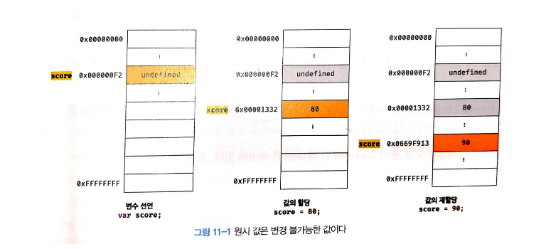

# 변수

## 1.1 변수란 무엇인가?

```
변수는 하나의 값을 저장하기 위해 확보한 메모리 공간 자체 또는 그 메모리 공간을 식별하기 위해 붙인 이름
```

- 간단히 말하자면 변수는 프로그래밍 언어에서 값을 저장하고 참조하는 메커니즘으로, 값의 위치를 가리키는 상징적인 이름이다.

&nbsp;

## 1.2 식별자

```
식별자는 어떤 값을 구별해서 식별할 수 있는 고유한 이름을 말한다.
```

- 값은 메모리 공간에 저장되어 있다. 따라서 식별자는 메모리 공간에 저장되어 있는 어떤 값을 구별해서 식별해낼 수 있어야 한다.

- 이처럼 식별자는 값이 아니라 메모리 주소를 기억하고 있다.

  &nbsp;

## 1.3 변수 선언

```
변수 선언이란 변수를 생성하는 것을 말한다.

변수를 사용하려면 반드시 선언이 필요하다. 변수를 선언할 때는 var, let, const 키워드를 사용한다. (ES6에서 let, const 키워드가 도입되기 이전까지 var 키워드는 유일한 키워드 였음)
```

> ES6에서 let과 const 키워드를 도입한 이유는 var 키워드의 여러 단점을 보완하기 위해서다.

```javascript
var score; // 변수 선언(변수 선언문)
```

위 변수 선언문은 다음과 같이 변수 이름을 등록하고 값을 저장할 메모리 공간을 확보한다.

```
변수를 선언한 이후, 아직 변수에 값을 할당하지 않았다. 따라서 변수 선언에 의해 확보된 메모리 공간은 비어 있을 것으로 생각할 수 있으나 확보된 메모리 공간에는 자바스크립트 엔진에 의해 undefined라는 값이 암묵적으로 할당되어 초기화된다.
```

> undefined는 자바스크립트에서 제공하는 원시 타입의 값이다.

- 변수를 사용하려면 반드시 선언이 필요하다.
- 변수뿐만 아니라 모든 식별자(함수, 클래스 등)가 그렇다. 만약 선언하지 않은 식별자에 접근하면 ReferenceError가 발생한다.

## 1.4 변수 선언의 실행 시점과 변수 호이스팅

```javascript
console.log(score); // undefined

var score; // 변수 선언(변수 선언문)
```

위 코드는 참조에러가 발생할 것 처럼 보이지만, undefined가 출력된다.

그 이유는 변수 선언이 소스코드가 한 줄씩 순차적으로 실행되는 시점, 즉 런타임이 아니라 그 이전 단계에서 먼저 실행되기 때문이다.

> 이처럼 변수 선언문이 코드의 선두로 끌어 올려진 것처럼 동작하는 자바스크립트 고유의 특징을 변수 **호이스팅** 이라 한다.

## 1.5 값의 할당 및 재할당

```javascript
var score; // 변수 선언(변수 선언문)
score = 80; // 값의 할당
```

```
변수 선언은 소스코드가 순차적으로 실행되는 시점인 런타임 이전에 먼저 실행되지만 값의 할당은 소스코드가 순차적으로 실행되는 시점인 런타임에 실행된다.
```

```javascript
console.log(score); // undefined

var score; // 변수 선언(변수 선언문)
score = 80; // 값의 할당

console.log(score); // 80
```

```javascript
var score = 80; // 변수 선언과 값의 할당
score = 90; // 값의 재할당
```

```
값을 재할당할 수 없어서 변수에 저장된 값을 변경할 수 없다면 변수가 아니라 상수라 한다.
```

> **const 키워드**
>
> ES에서 도입된 const 키워드를 사용해 선언한 변수는 재할당이 금지된다. 즉, const 키워드는 단 한 번만 할당할 수 있는 변수를 선언한다. 따라서 const 키워드를 사용하면 상수를 표현할 수 있다.



위 그림을 보면 현재 변수의 값은 90이다. score 변수의 이전 값인 undefined와 80은 어떤 변수도 값으로 갖고 있지 않다. 다시 말해, 어떤 식별자와도 연결되어 있지 않다.
이러한 불필요한 값들은 가비지 콜렉터에 의해 메모리에서 자동 해제된다.

> **가비지 콜렉터**
>
> 가비지 콜렉터는 애플리케이션 할당한 메모리 공간을 주기적으로 검사하여 더 이상 사용되지 않는 메모리를 해제하는 기능을 말한다.
> 자바스크립트는 가비지 콜렉터를 내장하고 있는 매니지드 언어로서 가비지 콜렉터를 통해 메모리 누수를 방지한다.

## 1.6 네이밍 규칙

식별자는 다음과 같은 네이밍 규칙을 준수해야한다.

- 식별자는 특수문자를 제외한 문자, 숫자, 언더스코어(\_), 달러 기호($)를 포함할 수 있다.
- 단, 식별자는 특수문자를 제외한 문자, 언더 스코어(\_), 달러 기호($)로 시작해야 한다. 숫자로 시작하는 것은 허용하지 않는다.
- 예약어는 식별자로 사용할 수 없다.


