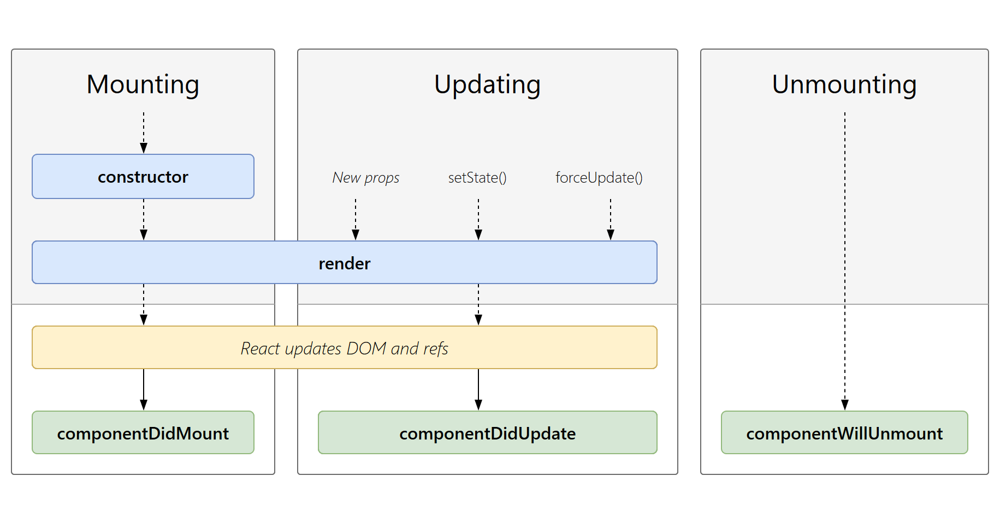

# 리액트 라이프 사이클이란?

리액트는 컴포넌트 기반의 View를 중심으로 한 라이브러리이다. 그러다보니 각각의 컴포넌트에는 라이프 사이클 즉, 컴포넌트의 **수명 주기** 가 존재한다. 컴포넌트의 수명을 보통 **페이지에서 렌더링되기 전인 준비과정에서 시작하여 페이지에서 사라질 때 끝이 난다.**



## 라이프 사이클의 분류

라이프 사이클은 그림과 같이 크게 세가지 유형으로 나눌 수 있다. 생성될 때, 업데이트할 때, 제거할 때이다. 이를 리액트에선 **마운트, 업데이트, 언마운트** 라고 한다.

-   마운트는 DOM이 생성되고 웹 브라우저상에 나타나는 것을 뜻하고, 반대로 언마운트는 DOM에서 제거되는 것을 뜻한다.
-   주의하여 볼 것은 업데이트 부분이다. 업데이트는 다음과 같이 4가지 상황에서 발생한다.
    -   props가 바뀔 때
    -   state가 바뀔 때
    -   부모 컴포넌트가 리렌더링 될 때
    -   this.forceUpdate로 강제로 렌더링을 트리거할 때

## 라이프 사이클 메서드

라이프 사이클에서 대표적으로 사용되는 메서드는

-   constructor
-   render
-   componentDidMount
-   componentDidUpdate
-   componentWillUnMount

5가지 이다(그 외의 추가로 존재하긴 함)

1. constructor
    - 클래스를 만들 때 초기 값을 지정해주는 생성자이다. 나는 자바를 해보지 않았지만, 자바 코드를 볼때마다 매번 볼 수 있다. 이 메서드에서는 초기 state를 정할 수 있다.

```javascript
// Class
class Example extends React.Component {
    constructor(props) {
        super(props);
        this.state = { count: 0 };
}

// Hooks
const Example = () => {
    const [count,setCount] = useState(0);
}
```

2. render
    - 가장 기초적인 메서드이기도 하고 가장 중요한 메서드이기도 합니다. 컴포넌트를 렌더링할 때 필요한 메서드로 유일한 필수 메서드이기도 하다. 함수형 컴포넌트에서는 render를 안쓰고 컴포넌트를 렌더링할 수 있다.

```javascript
// Class
class Example extends React.Component {
    render() {
        return <div>컴포넌트</div>;
    }
}

// Hooks
const example = () => {
    return <div>컴포넌트</div>;
};
```

3. componentDidMount
    - 이 메서드는 컴포넌트를 만들고 첫 렌더링을 마친 후 실행한다. 함수형 Hooks에서는 useEffect를 활용하여 다음 기능을 구현할 수 있다.

```javascript
// Class
class Example extends React.Component {
    componentDidMount() {
        ...
    }
}

// Hooks
const Example = () => {
    useEffect(() => {
        ...
    }, []);
}
```

여기서 useEffect의 [] 의존성 배열을 비워야지만 똑같은 메소드를 구현할 수 있다.

4. componentDidUpdate
    - 이것은 리렌더링을 완료한 후 실행한다. 업데이트가 끝난 직후 이므로, DOM 관련 처리를 해도 무방하다.

```javascript
// Class
class Example extends React.Component {
    componentDidUpdate(prevProps, prevState) {
        ...
    }
}

// Hooks
const Example = () => {
    useEffect(() => {
        ...
    });
}
```

5. componentWillUnmount
    - 이 메서드는 컴포넌트를 DOM에서 제거할 때 실행한다. componentDidMount에서 등록한 이벤트가 있다면 여기서 제거 작업을 해야한다. 함수형 컴포넌트에서는 useEffect clean up 함수를 통해서 해당 메서드를 구현할 수 있다.

```javascript
// Class
class Example extends React.Component {
    coomponentWillUnmount() {
        ...
    }
}

// Hooks
const Example = () => {
    useEffect(() => {

        // 클린업 함수
        return () => {
            ...
        }
    }, []);
}
```
