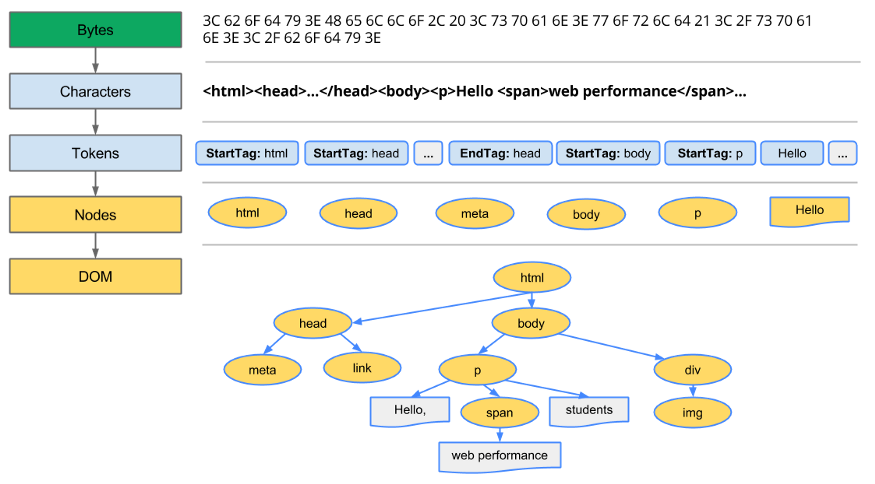
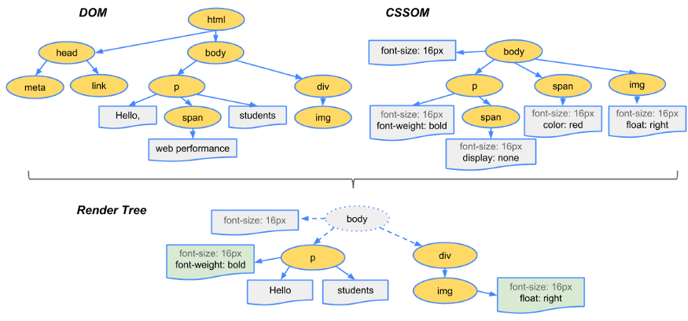

# 브라우저 렌더링

## 렌더링이란?

```
HTML, CSS, 자바스크립트 등 개발자가 작성한 문서가 브라우저에서 출력되는 과정을 말합니다.

브라우저마다 다르지만, 브라우저는 렌더링을 수행하는 렌더링 엔진을 가지고 있습니다.
크롬은 블링크(Blink), 사파리는 웹킷(Webkit) 그리고 파이어폭스는 게코(Gecko)라는 렌더링 엔진을 사용합니다.
```

## 렌더링 과정

```
사용자가 브라우저를 통해 웹 사이트에 접속하면, 서버로부터 HTML, CSS 등 웹 사이트에 필요한 리소스를 다운로드 받습니다. 브라우저가 페이지를 렌더링 하려면 먼저, HTML 코드는 DOM, CSS는 CSSOM 트리를 생성해야합니다.
```

### 1.1 DOM 트리 생성

```
다음은 HTML 코드가 DOM 트리로 변환하는 과정입니다.
```



1. 변환 : 브라우저가 HTML의 원시 바이트를 읽어와서, HTML에 정의된 인코딩(예:UTF-8)에 따라 개별 문자로 변환합니다.
2. 토큰화 : 브라우저가 문자열을 W3C표준에 지정된 고유 토큰으로 변환합니다.
3. 렉싱 : 방출된 토큰은 해당 속성 및 규칙을 정의하는 "객체"로 변환됩니다.
4. DOM 생성 : 마지막으로 HTML 마크업에 정의된 여러 태그 간의 관계를 해석해서 트리 구조로 연결이 됩니다.

브라우저는 HTML 마크업을 처리할 때 마다 위의 모든 단계를 수행합니다.

### 1.2 CSSOM 트리 생성

```
HTML 마크업 내에 직접(inline) 스타일을 선언할 수도 있지만, head 태그에 외부 (external) css 파일을 참조하거나, head 태그에 style 태그(internal)를 정의할 수 있습니다. HTML과 마찬가지로 외부 css 파일에 정의된 스타일과 style 태그에 작성된 스타일을 브라우저가 이해하고 처리할 수 있는 형식으로 변환해야 합니다.
```

DOM 트리를 생성하는 과정과 동일한 과정으로 CSSOM 트리를 생성합니다.


이런 과정을 거쳐서 마지막으로 CSSOM(CSS Object Model)이라는 트리 구조가 생성됩니다.


### 2. 렌더링(Rendering Tree) 생성

```
DOM 트리와 CSSOM 트리가 만들어지면, 이 둘을 결합해서 렌더링 트리를 생성합니다. 렌더링 트리에는 페이지를 렌더링 하는데 필요한 노드만 포함됩니다.
```



### 3. 레이아웃(Layout) 단계

```
레이아웃 단계에서는 뷰포트 내에서 각 요소의 정확한 위치와 크기를 정확하게 캡처하는 Box 모델이 출력됩니다. 모든 상대적인 측정값은 화면에서 절대적인 픽셀로 변환됩니다.
```


### 4. 페인팅(Paint) 단계

```
마지막으로 렌더링 트리의 각 노드를 화면의 실제 픽셀로 변환하게 됩니다. 레이아웃 단계에서 모든 계산이 완료가 되면, 화면에 요소들을 그리게 됩니다. 이 단계를 "페인팅" 또는 "래스터화" 라고 합니다.
```

이미 레이아웃 단계에서 각 노드들이 위치, 크기, 색상 등 스타일이 모두 계산이 되었기 때문에 화면에 실제 픽셀로 변환하게 됩니다.

## 요약 정리

1. HTML 마크업을 처리하고, DOM 트리를 빌드합니다.

2. CSS 마크업을 처리하고, CSSOM 트리를 빌드합니다.

3. DOM 및 CSSOM을 결합하여, 렌더링 트리를 형성합니다.

4. 렌더링 트리에서 레이아웃 실행하여, 각 노드의 기하학적 형태를 계산합니다.

5. 개별 노드를 화면에 페인트합니다.
